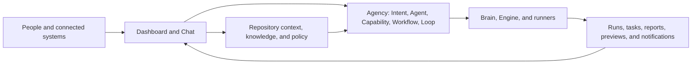

# Kody

Kody is a repository-aware control system for operating software and AI work.

It brings Chat, knowledge, agents, reusable capabilities, workflows, runs,
previews, files, and operational signals into one workspace without requiring a
team to move its application, repository, or CI pipeline onto Kody.

Kody is not another prompt-to-app builder. Coding agents can work inside the
system, but Kody's larger job is to preserve business direction, coordinate who
does what, execute through the appropriate runtime, and keep the resulting work
visible to people.

## What Kody provides

### One workspace for an existing repository

Every repository-scoped Kody surface keeps the active `owner/repository`
context. The Dashboard combines the repository's work, files, documentation,
CI state, previews, runs, reports, secrets, and AI configuration instead of
turning each concern into a disconnected tool.

### Chat as the operating interface

Kody Chat can answer questions, use repository and page context, work with
attachments, start actions, guide multi-step interactions, and show structured
results. Chat follows the user through the Dashboard, so the current repository
and page can remain part of the conversation.

The public [`@kody-ade/kody-chat`](packages/kody-chat) package is an embeddable
React chat surface. Hosts retain control of authentication, persistence,
transport, models, tools, and authorization.

### Persistent knowledge and governance

Kody gives important context a durable home instead of relying on one long
conversation or one general instruction file:

- **Docs** expose repository documentation.
- **Context** supplies curated knowledge to agents and Chat.
- **Policies** describe decision rules.
- **Constraints** define hard limits and guardrails.
- **Memory** preserves useful facts and feedback across conversations.
- **File spaces** organize repository-backed knowledge collections.

### A composable AI Agency

Kody separates direction, identity, reusable action, sequencing, activation,
and execution history:

| Model          | Responsibility                                             |
| -------------- | ---------------------------------------------------------- |
| **Intent**     | Plain-language direction for the Agency                    |
| **Todo**       | A finite operator-owned outcome with evidence and blockers |
| **Agent**      | The reusable identity selected to perform work             |
| **Capability** | One reusable method with instructions, skills, and tools   |
| **Workflow**   | An Agent-owned graph of Capability calls                   |
| **Loop**       | A repeated trigger targeting a Workflow or Capability      |
| **Run**        | The execution record and resulting output                  |

Capabilities remain independent from identity and sequencing. Workflows own
order, branching, bounded cycles, and approvals. Loops own repeated activation.
This keeps reusable work small while allowing larger processes to remain
explicit and reviewable.

See the [current Agency model](apps/dashboard/docs/concepts/models/README.md)
and [relationship map](apps/dashboard/docs/concepts/models/relationships.md)
for source-of-truth details and known integration gaps.

### Reusable definitions through the Store

The Kody Store can distribute reusable Agents, Capabilities, Workflows, Loops,
and related definitions. A repository activates the items it needs rather than
copying behavior by hand. Agency configuration can also be moved between
repositories as a portable bundle.

### Views and guided experiences

Views connect Chat to production, staging, development, and pull-request
environments. Saved paths, device sizes, and element selection let a user bring
the exact visible surface into the conversation.

GuidedFlows coordinate resumable multi-step conversations. JSON view renderers
provide validated structured Chat UI, while tenant-owned widgets support richer
business interactions through a small host contract. See the
[widget contract](docs/widget-contract.md).

### Flexible execution

Kody can route work through direct model-backed Chat, a long-lived Brain, the
Kody Engine, local processes, remote runners, Fly machines, and GitHub Actions.
The public contracts remain provider-neutral so execution choices do not leak
into reusable Agency definitions.

## How the system fits together



- **Dashboard and Chat** provide the repository-aware interface.
- **Knowledge** supplies durable context and governance.
- **Agency** defines what should happen and who should do it.
- **Brain** provides a long-lived conversational controller.
- **Engine and runners** perform executable work.
- **Convex** owns Dashboard runtime state.
- **GitHub** owns repository content, Actions, Engine definitions, Store assets,
  webhooks, and identity-related integration.

## Current product surfaces

| Area            | What users can do                                                          |
| --------------- | -------------------------------------------------------------------------- |
| Dashboard       | See work, CI and Engine health, reports, and items needing attention       |
| Chat            | Hold repository-aware conversations and start guided or executable actions |
| Tasks and Todos | Track active work and finite outcomes                                      |
| Files and Docs  | Browse and manage repository content through the shared file workspace     |
| Views and Vibe  | Inspect environments, connect selected UI to Chat, and review changes      |
| Knowledge       | Manage Docs, Context, Policies, Constraints, Memory, and file spaces       |
| Agency          | Manage Intents, Agents, Capabilities, Workflows, Loops, and Runs           |
| Store           | Discover and activate reusable definitions for a repository                |
| Content         | Manage CMS models, entries, adapters, and related client content           |
| System          | Configure models, Brain, runners, secrets, variables, and notifications    |

## Current status

Kody is under active development. The Dashboard, Chat, repository workspaces,
Knowledge surfaces, Capabilities, Workflows, Runs, Store, Views, CMS, Brain,
and supporting infrastructure are implemented at different levels of maturity.

The simplified Agency model is not yet fully integrated end to end. In
particular, Loop definitions created by the current Dashboard are not yet
consumed by the published scheduler contract. The
[Agency model index](apps/dashboard/docs/concepts/models/README.md) records the
current Dashboard, persistence, Engine, and runtime boundaries; do not infer
runtime support from the presence of a form or type alone.

The public Kody Chat package has been separated from Dashboard-specific code,
but publishing it to a registry remains a separate release step.

## Run Kody locally

Prerequisites:

- Node.js compatible with the workspace packages
- pnpm 9
- the Dashboard environment and GitHub access described in
  [`apps/dashboard/README.md`](apps/dashboard/README.md)

```bash
pnpm install
pnpm dev
```

The Dashboard runs at <http://localhost:3333>. Repository-owned pages use the
canonical route:

```text
http://localhost:3333/repo/<owner>/<repo>/...
```

## Verification

Run the repository-wide verification command for every code or configuration
change:

```bash
pnpm verify
```

Useful focused commands:

```bash
pnpm typecheck
pnpm lint
pnpm test:unit
pnpm build
pnpm --filter kody-dashboard test:e2e:gate
pnpm --filter kody-dashboard test:e2e:live:gate
```

See the [testing policy](docs/testing-policy.md) for the required distinction
between unit, integration, mocked browser, live local, and deployed proof.

## Repository layout

This repository contains the product, its feature packages, and its host
application. The package map is contributor information, not the product
definition.

| Path                           | Package                         | Responsibility                                                          |
| ------------------------------ | ------------------------------- | ----------------------------------------------------------------------- |
| `apps/dashboard`               | `kody-dashboard`                | Repository-aware Next.js operations Dashboard                           |
| `packages/kody-chat`           | `@kody-ade/kody-chat`           | Public embeddable React Chat                                            |
| `packages/kody-chat-dashboard` | `@kody-ade/kody-chat-dashboard` | Private Dashboard integration and composition                           |
| `packages/base`                | `@kody-ade/base`                | Shared platform contracts, GitHub, auth, vault, events, storage, and UI |
| `packages/workspace`           | `@kody-ade/workspace`           | Context, memory, commands, brands, Todos, and workspace features        |
| `packages/agency`              | `@kody-ade/agency`              | Agency definitions, runs, capabilities, approvals, and trust            |
| `packages/agency-domain`       | `@kody-ade/agency-domain`       | Infrastructure-free Agency domain contracts                             |
| `packages/brain`               | `@kody-ade/brain`               | Brain runtime control and proxy                                         |
| `packages/terminal`            | `@kody-ade/terminal`            | Local and remote terminal sessions and checkpoints                      |
| `packages/fly`                 | `@kody-ade/fly`                 | Fly previews, runners, machines, and builder integration                |
| `packages/cms`                 | `@kody-ade/cms`                 | CMS model, adapters, routes, tools, and MCP surface                     |
| `packages/memory`              | `@kody-ade/memory`              | Pure memory domain and application contracts                            |
| `packages/engine-contracts`    | `@kody-ade/engine-contracts`    | Provider-neutral Engine request contracts                               |
| `packages/kody-backend`        | `@kody-ade/backend`             | Convex schema, functions, and backend tooling                           |

## Architecture rules

- Extend the system that already owns a responsibility before creating another
  component, workflow, API, storage path, or subsystem.
- Dashboard runtime state is Convex-owned and must not fall back to GitHub.
- Repository features preserve the selected `owner/repository` through routes,
  APIs, and persistence.
- The shared file manager stays domain-agnostic; product behavior belongs in
  caller-owned adapters.
- Public Kody Chat never contains Dashboard secrets, privileged tools, routes,
  or storage implementations.
- Commit, push, package publication, deployment, and live production proof are
  separate outcomes.

## Documentation

- [Project assessment](docs/project-assessment.md)
- [Project behavior](docs/project-behavior.md)
- [Dashboard UI principles](docs/ui-design-principles.md)
- [Testing policy](docs/testing-policy.md)
- [Agency model](apps/dashboard/docs/concepts/models/README.md)
- [Capabilities](apps/dashboard/docs/capabilities.md)
- [Workflows](apps/dashboard/docs/workflows.md)
- [Widget contract](docs/widget-contract.md)
- [Dashboard setup and development](apps/dashboard/README.md)
- [Embeddable Kody Chat](packages/kody-chat/README.md)
