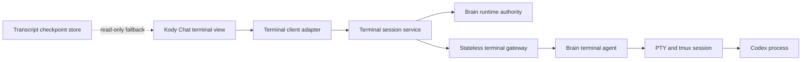
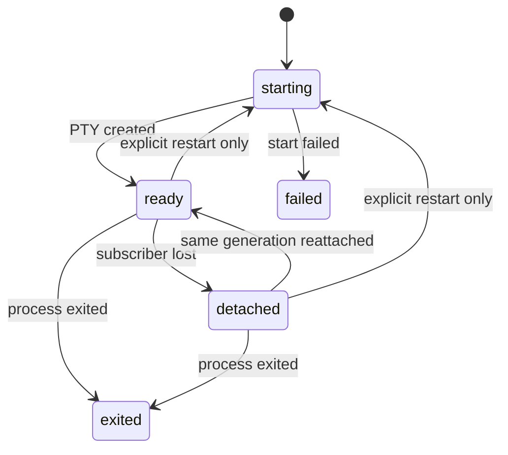

# Brain Terminal Architecture Plan

## Status

Implemented locally through Phase 5. Phase 6 package, integration, production
build, and real-Codex process-continuity proof passed. Terminal setup is now an
explicit user action: ordinary terminal attachment never provisions or replaces
infrastructure, setup failures remain visible, and restart is unavailable until
a terminal is connected.

Live rollout is not complete. The Brain terminal agent and image changes exist
only in the local `kody-engine` checkout, while Brain image publishing resolves
the engine from a pushed Git commit. The configured Fly token also cannot access
the saved Brain app. The engine changes must be committed and pushed, the Brain
image must be published, and the Fly authorization must be corrected before the
deployed terminal can pass the live gate.

## Outcome

A Brain terminal running Codex survives browser reloads, WebSocket failures,
Dashboard restarts, and terminal-gateway deployments without replacing the
process or clearing its screen.

The architecture has one owner for terminal-session lifecycle and one owner
for each supporting concern. Reconnecting transport must never mean restarting
the terminal session.

## Verified Current Problems

1. Session lifecycle is split across the React surface, terminal registry,
   browser reconnect engine, terminal API use case, Fly bridge, tmux wrapper,
   checkpoint restore, and bridge deployment.
2. `ChatTerminalSurface` owns xterm rendering, local PTY polling, remote
   WebSockets, retries, input acknowledgements, snapshots, and restart behavior.
3. The Fly bridge combines infrastructure provisioning, authentication,
   WebSocket framing, SSH, tmux, session state, retries, execution jobs, and an
   HTTP server in one generated script.
4. Durable tmux state currently lives on the terminal bridge machine, not the
   Brain machine where Codex runs. Replacing the bridge can therefore replace
   the user's terminal state.
5. A terminal connection request can converge or replace the bridge machine.
   User connection and infrastructure deployment are coupled.
6. Checkpoint replay can write into the same xterm surface that represents a
   live session. Historical output and live-session state are not cleanly
   separated.
7. The browser and bridge both retry. They can react to the same failure and
   create feedback loops.
8. Current live coverage opens a shell and runs simple commands, but does not
   start Codex and prove that the same Codex session survives reconnection.
9. Many bridge tests assert generated source text rather than executing the
   real runtime behavior. They can pass while the user journey fails.

## Non-Negotiable Invariants

- A terminal session has one opaque identity and one current generation.
- Only an explicit user restart may increment the generation or replace the
  process.
- Browser reconnect, page reload, gateway restart, and gateway deployment only
  reattach to the same generation.
- The Brain machine owns the PTY and durable multiplexer session.
- The browser never provisions infrastructure and never decides to reset a
  remote terminal.
- The gateway never owns durable terminal state.
- Checkpoints are historical transcripts. They never change live connection
  state and never overwrite a live terminal.
- One state machine defines all valid lifecycle transitions.
- One owner handles each retry class. Retry policies cannot overlap.
- Brain runtime selection remains owned by the existing Brain runtime
  authority. Terminal code consumes that authority and does not create a
  second source of truth.
- Runtime state must follow the repository rule that Dashboard runtime state is
  Convex-owned; terminal work must not add GitHub runtime-state readers,
  fallbacks, or dual writes.

## Target Ownership



### `@kody-ade/terminal`: domain and protocol

Owns only:

- terminal session identifiers;
- lifecycle state machine;
- commands, events, and protocol validation;
- transport-neutral retry classifications;
- contract tests.

It must not import React, Fly, Brain, xterm, Next.js, or persistence adapters.

### `@kody-ade/brain`: Brain terminal application service

Owns only:

- resolving the current Brain runtime through the existing runtime authority;
- authorizing a repository-scoped Brain terminal;
- mapping the generic terminal contract to the Brain terminal agent;
- reporting Brain-specific warnings without changing terminal lifecycle.

It must not implement WebSocket framing, xterm behavior, tmux commands, or
browser retries.

### Brain terminal agent in `kody-engine`

Owns:

- creating, attaching, inspecting, resizing, and stopping the PTY/tmux session;
- the authoritative session generation and process liveness;
- bounded output replay needed to redraw a reattached client;
- input acknowledgement after bytes reach the live PTY;
- explicit restart.

The current Brain image does not install tmux and has no terminal agent. This
is a required `kody-engine`/Brain-image change, not behavior that belongs in
Dashboard or the Fly gateway.

### `@kody-ade/fly`: infrastructure and stateless transport

Owns only:

- reaching the selected Brain machine;
- a stateless authenticated WebSocket or stream proxy when direct access is not
  suitable;
- Fly machine wake and network errors;
- independent gateway deployment.

It must not own `persistentSessions`, tmux, terminal generations, screen
history, user-session retry policy, or checkpoints. Connecting a user must not
replace or redeploy the gateway.

### Kody Chat terminal client

Split into two responsibilities:

- `useTerminalSession`: subscribes to one session, sends typed commands, and
  exposes the domain state;
- `TerminalView`: mounts xterm, renders bytes and controls, and forwards user
  input.

The UI may retry only a lost network subscription to the same session ID. It
may not create a replacement session, reset a generation, or infer process
liveness from WebSocket state.

### Checkpoints

Checkpoints contain transcript output for a terminal that is no longer live.
They are displayed as read-only history or added to chat. They do not call
`clear()`, do not change connection state, and are never replayed over a live
terminal surface.

## Simple Domain Model

```ts
type TerminalSessionId = string;

interface TerminalSession {
  id: TerminalSessionId;
  scope: {
    owner: string;
    repo: string;
    conversationId: string;
  };
  target: { kind: "brain"; runtimeId: string };
  generation: number;
  state: TerminalSessionState;
  revision: number;
}

type TerminalSessionState =
  "starting" | "ready" | "detached" | "exited" | "failed";

type TerminalCommand =
  | { type: "attach"; sessionId: TerminalSessionId; afterRevision?: number }
  | {
      type: "input";
      sessionId: TerminalSessionId;
      inputId: string;
      data: string;
    }
  | { type: "resize"; sessionId: TerminalSessionId; cols: number; rows: number }
  | { type: "detach"; sessionId: TerminalSessionId }
  | { type: "restart"; sessionId: TerminalSessionId };

type TerminalEvent =
  | { type: "state"; state: TerminalSessionState; generation: number }
  | { type: "output"; revision: number; data: string }
  | { type: "input-accepted"; inputId: string }
  | { type: "exited"; code?: number }
  | { type: "failed"; code: string; message: string };
```

The model intentionally excludes UI labels, Fly app names, WebSocket state,
checkpoint state, retry counters, xterm state, and tmux implementation details.

## Lifecycle Rules



- A WebSocket closing changes subscription state, not terminal generation.
- Gateway failure leaves the Brain-owned session in `ready` or `detached`.
- `restart` is the only command allowed to create a new generation.
- Events carry monotonically increasing revisions so a reconnect can request
  only missing output.

## Retry Ownership

| Failure                               | Owner                     | Allowed action                                        |
| ------------------------------------- | ------------------------- | ----------------------------------------------------- |
| Browser network interruption          | Terminal client adapter   | Re-subscribe to the same session ID                   |
| Gateway-to-Brain network interruption | Stateless gateway         | Reconnect transport to the same session ID            |
| Brain machine sleeping                | Terminal session service  | Wake the selected runtime, then attach                |
| PTY process exited                    | Brain terminal agent      | Report `exited`; never auto-restart                   |
| Explicit user restart                 | Terminal session service  | Increment generation and create a new PTY             |
| Gateway deployment                    | Infrastructure deployment | Drain/replace gateway without touching Brain sessions |

No layer may convert its retry into an implicit `restart`.

## Migration Phases

### Phase 0: Baseline and freeze

- Keep the experimental reconnect patches reverted.
- Freeze new checkpoint, retry, and bridge-session behavior.
- Capture the failing Codex journey and exact network/runtime evidence.
- Record the current session ID, bridge machine, Brain machine, and observed
  reset point.

Gate: the failure is reproducible and the evidence distinguishes browser,
gateway, and Brain-process events.

### Phase 1: Domain contract

- Add the transport-neutral model and state reducer to `@kody-ade/terminal`.
- Define commands/events with runtime validation.
- Define session generation and output revision semantics.
- Add exhaustive transition, idempotency, stale-event, and invalid-command
  tests.

Gate: every lifecycle transition is proven without React, Fly, Brain, or
tmux.

### Phase 2: Brain-owned session agent

- Add tmux and the terminal agent to the Brain image in `kody-engine`.
- Keep PTY/tmux sessions on the Brain machine.
- Implement create, attach, input, resize, detach, status, and explicit restart.
- Prove an alternate-screen fixture survives client disconnect and agent
  subscription reconnect without changing generation.

Gate: integration tests run a real PTY and full-screen fixture on the Brain
image; reconnect preserves PID, generation, and screen output.

### Phase 3: Session service and stateless gateway

- Make one server-side session use case consume Brain runtime authority.
- Reduce the Fly bridge to authenticated byte transport, or bypass it when a
  direct authenticated Brain stream is proven safe.
- Move gateway deployment out of the user connection request.
- Remove gateway-owned tmux and in-memory durable-session claims.

Gate: restarting or replacing the gateway does not change the Brain terminal
generation.

### Phase 4: Thin client adapter and view

- Introduce `useTerminalSession` as the only client lifecycle adapter.
- Make the xterm component presentation-only.
- Remove remote lifecycle refs, retry counters, and infrastructure decisions
  from `ChatTerminalSurface`.
- Keep the existing visible terminal flow unless a verified requirement needs
  a UI change.

Gate: component tests prove rendering and commands; browser tests prove a page
reload reattaches to the same generation.

### Phase 5: Remove competing owners

- Remove browser session recreation and reset-on-reconnect paths.
- Remove bridge retry/session/tmux ownership.
- Remove checkpoint-to-live-surface restore behavior.
- Remove duplicate connection state from the registry and surface.
- Retire source-string tests after equivalent behavioral coverage exists.

Gate: repository search shows one lifecycle reducer, one restart command, and
no automatic remote reset path.

### Phase 6: Live Codex proof and rollout

- Start a real Brain terminal from the canonical repository URL.
- Start the real Codex full-screen application.
- Record session ID, generation, and process identity through a diagnostic
  test endpoint unavailable in production UI.
- Reload the browser, interrupt the WebSocket, restart the gateway, and deploy
  a new gateway version.
- After each event, prove the same session generation and Codex process remain,
  and prove new input receives output.
- Run package tests, integration tests, canonical browser gate, live UI gate,
  build, and deployed live proof.

Gate: no skipped live journey and no mocked external terminal service.

## Rollout Safety

- Use one server-side migration switch; never run two terminal writers for one
  session.
- Migrate test sessions first, then one controlled user, then general use.
- Rollback changes routing or deployment only; Brain-owned sessions remain
  alive.

## Architecture Acceptance Criteria

- One lifecycle state machine.
- One explicit restart command.
- One durable session owner on the Brain machine.
- Stateless gateway.
- Presentation-only xterm view.
- No checkpoint writes into a live terminal.
- No infrastructure deployment during user connect.
- No source-string test used as proof of runtime behavior.
- Real Codex survives browser, socket, gateway, and deployment interruptions.
- The final dependency direction is:

```text
Kody Chat UI -> Terminal contract -> Brain terminal service
                                      -> Fly transport adapter
                                      -> Brain terminal agent
```

## Implemented Decisions

1. Keep one Brain terminal session per conversation and repository.
2. Use an authenticated stateless gateway; do not expose Brain credentials to
   the browser.
3. Use one writer and one lifecycle reducer. Parallel dual-write and
   dual-session migration are rejected.

## Verification Record

- Domain lifecycle, stale-event, invalid-command, and protocol tests pass.
- A real tmux PTY and alternate-screen fixture survive detach and reattach with
  the same process identity and generation.
- The generated gateway was executed with two real WebSocket subscriptions;
  reconnect preserved the session and output revision.
- A real Codex 0.144.6 full-screen process survived detach and reattach with
  generation `1` and process ID `47627`, then accepted input after reconnect.
  The model request inside the disposable container could not complete because
  that container rejected the upstream TLS certificate as `UnknownIssuer`;
  this did not restart the Codex process or terminal session.
- Terminal, Fly, Brain, Dashboard, and kody-engine focused tests, type checks,
  and production builds pass.
- The repository-scoped browser setup journey passes: an unavailable terminal
  offers explicit setup, denied Fly access offers the repository Secrets page,
  and restart remains disabled while disconnected.
- The full Dashboard unit suite currently has seven unrelated failures in
  prompt fixtures, repository navigation, and chat settlement. The first
  browser-gate shard has five unrelated chat selection/persistence failures;
  the terminal setup journey passes when run directly.
- The deployed live UI test remains operationally blocked: the Brain image
  cannot include unpushed local engine changes, and the configured Fly token
  cannot access the saved Brain app. No connection or retry path may silently
  replace that user-owned Brain to bypass either rollout requirement.
